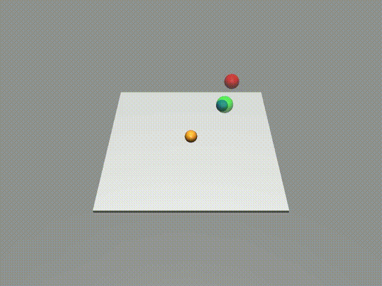
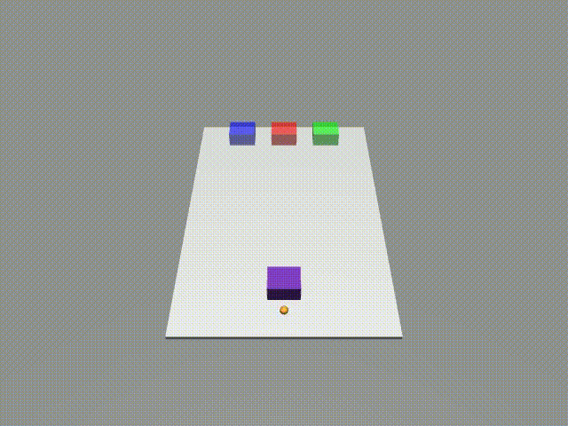

# Humanoid SWE Challenge

MuJoCo robotic simulation environments controlled by an LLM agent via the Model Context Protocol (MCP). The agent uses tool calls to observe and control simulations in a feedback loop until tasks are complete. Please do not hesitate to reach out if you have any questions :) 

## Contents

- [Overview](#overview)
- [Architecture](#architecture)
- [Known Issues](#known-issues)
- [Installation](#installation)
- [Configuration](#configuration)
- [Usage](#usage)
- [MCP Tools](#mcp-tools)
- [Observations](#observations)
- [Action Control](#action-control)
- [Logs & Videos](#logs--videos)

## Overview
Two simulation tasks are included:
- **Pusher Manipulation** — move a pusher to sequentially reach coloured goal positions (blue → red → green)
- **Box Pushing** — A non-prehensile manipulation task where the agent must use the pusher to slide a purple box onto a blue goal region.

| Pusher Manipulation | Box Pushing |
|---|---|
|  |  |

The LLM agent connects to an MCP server (one per task) via stdio, receives tool descriptions, and drives the MuJoCo simulation using position observations and velocity control.

I choose to use MuJoCo because I have trained RL agents in these environments before for my undergraduate dissertation, and I am intrested in seeing how an LLM agent performs on them as a comparison to traditional RL agents. 

MCP was chosen for its simplicity and flexibility in exposing tools to the LLM agent.

## Architecture
- **`src/humanoid_swe_challenge/llm_agent/`** — Agent loop; calls the LLM with MCP tools, parses tool calls, trims context when it grows long
- **`src/humanoid_swe_challenge/mcp/`** — FastMCP servers exposing tools to control the MuJoCo simulations; one server per task.
- **`src/humanoid_swe_challenge/sims/`** — Gymnasium environments wrapping MuJoCo; not directly interacted with by the agent, but used by the MCP servers to run the simulations
- **`scripts/`** — playback scripts to replay logged action sequences with the MuJoCo viewer

## Known Issues
- Task success may depend on the LLM model and prompt used. We tested the default prompt with `qwen/qwen3.6-35b-a3b:2` hosted locally via LM Studio at `temperature=0`, but may not work well with other models or prompts out of the box. In particular, the box-pushing task requires a more carefully engineered prompt and a model capable of processing visual inputs to understand the environment spatially. If you are having trouble, try experimenting with different prompts and models.

- The agent may occasionally issue invalid tool calls (e.g. non-numeric velocity values) which cause the MCP server to error. The agent will not recover from this and must be restarted.

- MuJoCo renderer may not display properly with `render_mode="human"` on some platforms; try switching to `render_mode="rgb_array"` if you encounter compatibility issues.

- The MCP tool `get_visual()` for the box-pushing task may fail to return renders if the MuJoCo environment fails to initialise the renderer properly; this seems to be a common issue when running MuJoCo as a subprocess.

- Rendering the simulation while the agent is running was implemented but is disabled by default as it seems to cause some stability issues with the MuJoCo environment when run as a subprocess. If you want to enable rendering, you can change the `render_mode` variable in the MCP server code for the respective task.

## Installation

Requires Python ≥ 3.11 and a working MuJoCo installation.

```bash
pip install -e .
```

## Configuration

| Variable | Default | Description |
|---|---|---|
| `LLM_URL` | `http://localhost:1234/v1` | OpenAI-compatible API base URL |
| `LLM_MODEL` | `qwen/qwen3.6-35b-a3b:2` | Model name |
| `LLM_API_KEY` | `not-needed` | API key (if required) |
| `LLM_TOKEN_LIMIT` | `-1` | Max tokens for LLM responses |
| `MCP_SERVER_CMD` | `pusher-manip-mcp` | Command to start the MCP server subprocess |
| `USER_PROMPT` |  | Initial prompt for the LLM agent  |

The active MCP server command and user prompt are set in [src/humanoid_swe_challenge/config.py](src/humanoid_swe_challenge/config.py) the default configuration runs the pusher manipulation task. Uncomment the box-pushing lines and comment the pusher manipulation lines to switch tasks.
## Usage

### Run the agent

```bash
humanoid-llm-agent
```

The agent will start the MCP server as a subprocess, initialise the simulation, and autonomously issue control commands until the task succeeds. Action sequences are saved automatically to `log/`.

### Replay a logged run

**Edit the `np.load(...)` path in the script to point to the desired log file under `log/`.**

```bash
# For Linux:
python scripts/pusher_manip_playback.py
# or
python scripts/box_pushing_playback.py
```
```bash
# For MacOs:
mjpython scripts/pusher_manip_playback.py
# or
mjpython scripts/box_pushing_playback.py
```

### Run an MCP server standalone (for debugging or use with custom agents)

```bash
pusher-manip-mcp
# or
box-pushing-mcp
```

## MCP Tools
MCP servers host the following tools for the LLM agent to interact with the simulations:

| Tool | Description |
|---|---|
| `start_simulation()` | Initialise the environment and return the first observation |
| `get_observation()` | Return current positions of pusher and goals (and box, for box-pushing) |
| `control_pusher(vx, vy, vz, step_size)` | Apply velocity control for N steps; returns updated observation |
| `get_simulation_description()` | Return task description and success criteria |
| `close_simulation()` | Close the MuJoCo environment |
| `get_visual()` | For Box-pushing tasks only, return a base64-encoded JPEG render of the current frame |

## Observations

### Pusher Manipulation


| Key | Type | Description |
|---|---|---|
| `pusher_xyz` | `[float, float, float]` | Pusher position in meters |
| `goal_red_xyz` | `[float, float, float]` | Red goal position in meters |
| `goal_green_xyz` | `[float, float, float]` | Green goal position in meters |
| `goal_blue_xyz` | `[float, float, float]` | Blue goal position in meters |


### Box Pushing

Box-pushing observations include the same pusher and goal position information as pusher manipulation, as well as the following additional information about the box state:

| Key | Type | Description |
|---|---|---|
| `box_xyz` | `[float, float, float]` | Box center position in meters |
| `box_yaw` | `float` | Box rotation around z-axis in radians |
| `goal_red_yaw` | `float` | Red goal yaw in radians |
| `goal_green_yaw` | `float` | Green goal yaw in radians |
| `goal_blue_yaw` | `float` | Blue goal yaw in radians |
| `pusher_in_contact_with_box` | `bool` | Whether the pusher is currently touching the box |
| `get_visual()`| base64-encoded JPEG | For Box-pushing tasks only, return a render of the current frame |

## Action Control
Both tasks use the same control scheme: 
| Key | Type | Description |
|---|---|---|
| `vx` | `float` | Pusher velocity in x direction (m/s) |
| `vy` | `float` | Pusher velocity in y direction (m/s) |
| `vz` | `float` | Pusher velocity in z direction (m/s) |
| `step_size` | `int` | Number of simulation steps to apply the velocity |

## Logs & Videos
- Action sequences will be saved automatically to `log/<date>/<time>.npy` after each the MuJoCo environment is closed.
- Demo logs are in `log/demo/`.
- Example videos are in `video/`.

